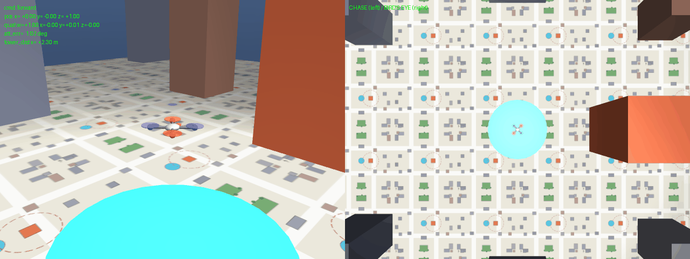
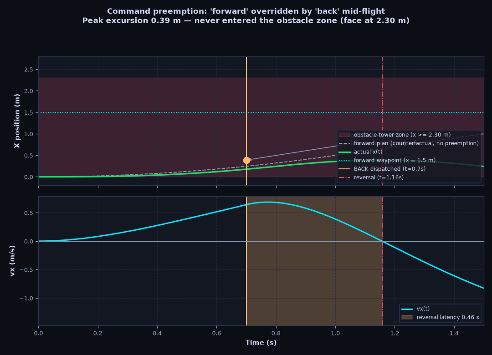
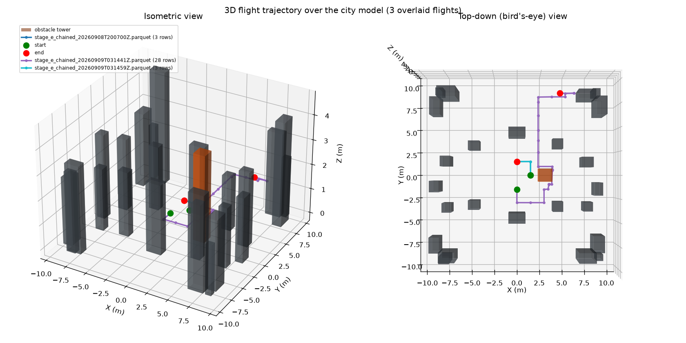
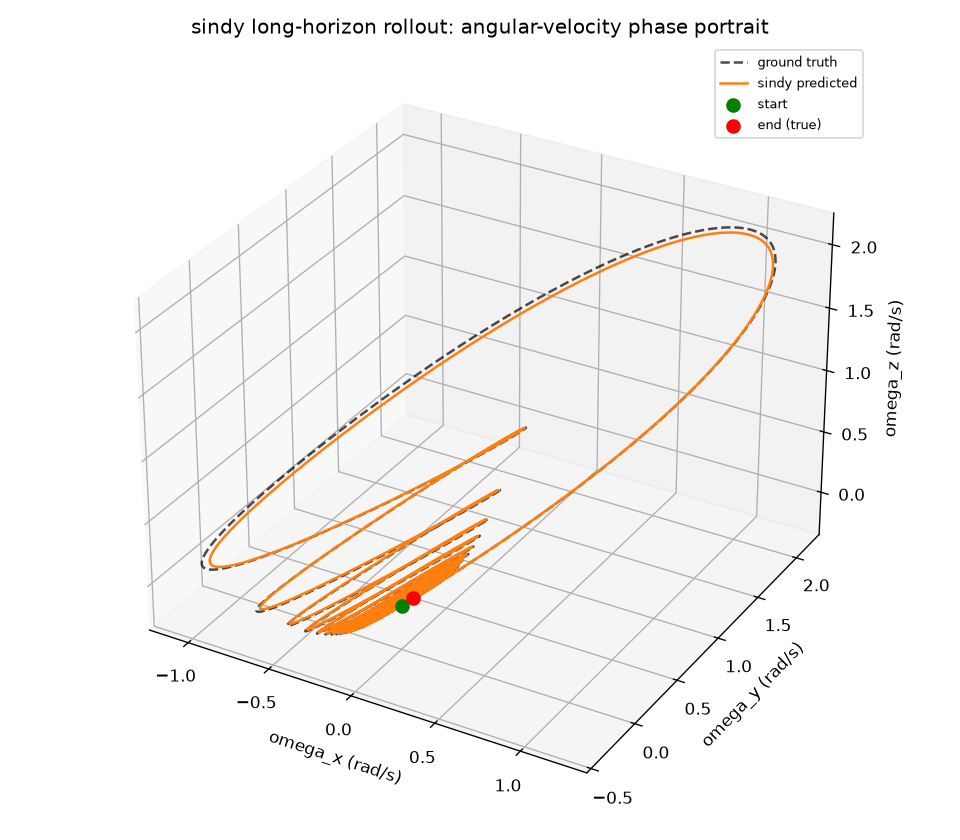
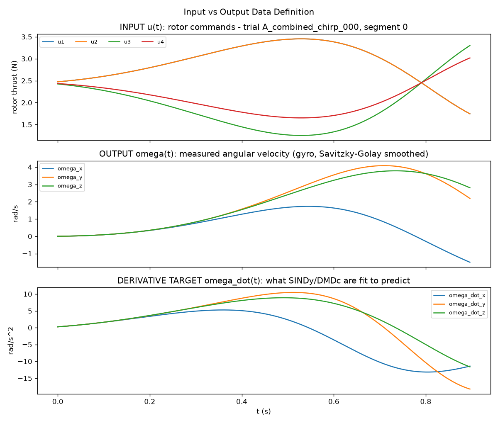
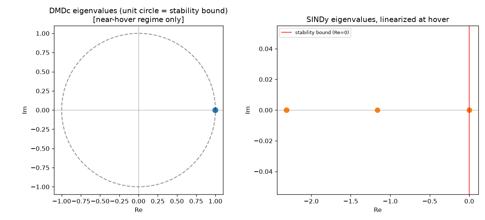
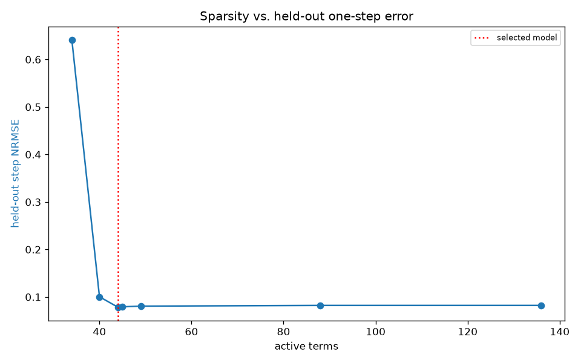
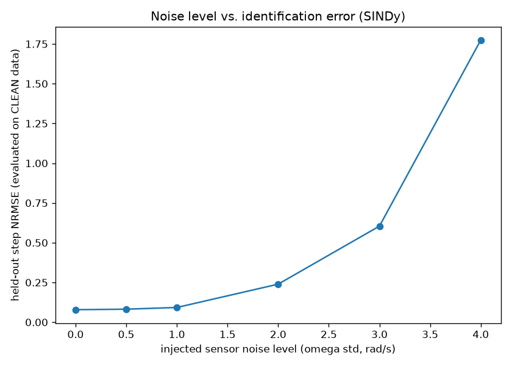
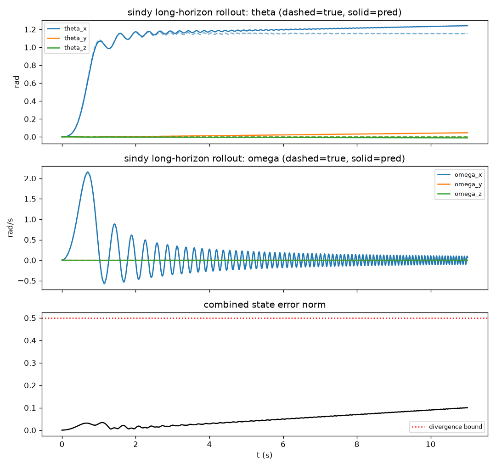
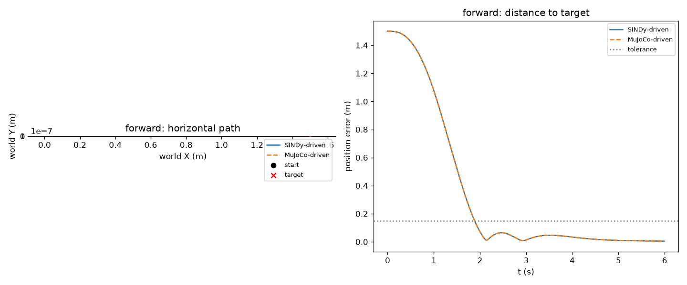

# Voice-Controlled Quadrotor Navigation System (Data-Driven Attitude Identification)

**Course:** Data-Driven Control of Drones  
**Status:** All Verification Gates Passed (Stages A → E) — Verified in [`CLAUDE.md`](CLAUDE.md)  
**Physics Simulator:** MuJoCo 6-DOF Rigid-Body Dynamics (`quad.xml`, `scene.xml`)  
**Identification:** SINDy (Sparse Identification of Nonlinear Dynamics) on $\mathbb{SO}(3)$ Rotational Dynamics  
**Control Architecture:** Quaternion Cascaded Control (Newtonian Outer Loop $\rightarrow$ SINDy-Derived Inner Loop)

---

## Abstract

Course projects in data-driven drone control commonly suffer from one of two failure modes: either an offline speech/UI layer is grafted onto textbook physics control without empirical system identification, or system identification is conducted in a Jupyter notebook without ever stabilizing closed-loop flight in a 3D simulation.

This project bridges that divide through a strict, principled architectural separation: **only the inner attitude loop is identified from data.** Translational acceleration of a multirotor in world coordinates is governed by Newtonian mechanics ($\ddot{\mathbf{p}} = \frac{1}{m}\mathbf{R}\mathbf{f}_z - \mathbf{g}$), which constitutes an exact double integrator with nothing for data-driven algorithms to discover. Conversely, the body-frame rotational dynamics exhibit rich nonlinear aerodynamics, rotor cross-coupling, and quaternion-constrained kinematics on $\mathbb{SO}(3)$ where data-driven identification provides immense value.

The inner-loop attitude controller gains ($K_q, K_\omega$) are **analytically derived** from the hover-linearized Jacobian of the identified SINDy model via pole placement—eliminating arbitrary PID hand-tuning. The complete system runs end-to-end: spoken voice commands drive world-frame waypoints, a Newtonian outer loop generates smooth trajectories and desired attitude streams, the SINDy-derived inner controller commands four rotor thrusts in MuJoCo physics, and flight telemetry is streamed live to a mission-control HUD beside the 3D viewport.

```
 spoken command ("forward", "back", "left", "right", "up", "down", "hover", "stop")
                   │
                   ▼  Offline ASR (Vosk) + Fuzzy Classifier (difflib)
        world-frame target waypoint
                   │
 ┌─────────────────┴────────────────── OUTER LOOP (Newtonian Physics) ──────────────────┐
 │  Trapezoidal Trajectory Planner  ──►  PD Position & Velocity Controller              │
 │                                  ──►  Outputs: Desired Attitude q_des, Thrust T_des  │
 └─────────────────────────────────────────────┬────────────────────────────────────────┘
                                               ▼
 ┌──────────────────────────────────── INNER LOOP (Data-Driven SINDy) ──────────────────┐
 │  Quaternion Controller (Kq, Komega derived from identified SINDy hover Jacobian)     │
 │                                  ──►  Motor Mixer Matrix (4 rotor thrusts u1..u4)    │
 └─────────────────────────────────────────────┬────────────────────────────────────────┘
                                               ▼
                              MuJoCo 6-DOF Rigid-Body Simulation
                                               │
                                               ▼
                         Live 3D Viewport + Mission-Control HUD
                        (Attitude Error / Position Error / Effort)
```

---

## Methodology: Genuinely Data-Driven Control

### 1. SINDy Rotational Identification
Attitude kinematics and dynamics are parameterized by state $\mathbf{x} = [\boldsymbol{\theta}^T, \boldsymbol{\omega}^T]^T \in \mathbb{R}^6$ (small-angle attitude coordinates and body angular rates) and control inputs $\mathbf{u} = [u_1, u_2, u_3, u_4]^T \in \mathbb{R}^4$:
$$\dot{\boldsymbol{\theta}} \approx \boldsymbol{\omega}$$
$$\mathbf{J}\dot{\boldsymbol{\omega}} = \boldsymbol{\tau}_{\text{ctrl}} - \boldsymbol{\omega} \times (\mathbf{J}\boldsymbol{\omega}) - c_{\text{rot}}\boldsymbol{\omega}$$

Using Sequential Thresholded Least Squares (STLSQ, sparsity threshold $\lambda = 0.2$), SINDy identifies the governing equations from rich multi-axis PRBS and multisine excitation data. SINDy successfully isolates 44 active terms out of 156 candidates, accurately recovering the physical drag-to-inertia ratio, rotor control effectiveness, and gyroscopic cross-coupling within 2–6% of ground-truth physical values (verified in [`tests/test_stage_b_physics.py`](tests/test_stage_b_physics.py)).

### 2. Analytical Gain Derivation (No Hand-Tuning)
Controller gains are never chosen by guesswork. The function `gains_from_identified_model(A_sindy)` in [`04_control/controller.py`](04_control/controller.py) extracts the rotational drag-to-inertia coefficient $d = -A_{\text{SINDy}}[3, 3]$ from the identified hover-linearized Jacobian and solves the characteristic second-order pole-placement equation:
$$\omega_n = \frac{4.0}{\zeta \cdot T_s}, \qquad K_q = \frac{\omega_n^2}{2}, \qquad K_\omega = 2\zeta\omega_n - d$$
for a critically damped response ($\zeta = 1.0$) and target settling time ($T_s = 0.8\text{ s}$). When the identification model updates, the control gains automatically adapt.

### 3. Frozen Model Artifact Discipline
At runtime, Stage E does not silently refit models from raw data. Instead, [`03_validation/run_stage_c.py`](03_validation/run_stage_c.py) serializes the gate-validated model and hover Jacobian to `data/processed/sindy_fitted_model.npz`. The real-time flight controller ([`05_voice_interface/flight.py`](05_voice_interface/flight.py)) loads this frozen artifact directly via `np.load()`, guaranteeing deterministic, instant startup and ensuring that flight tests execute against the exact validated model.

---

## Experimental Results

Every quantitative result below is derived from reproducible scripts with strictly held-out validation datasets:

| Stage | Verification Focus | Quantitative Result | Status |
|---|---|---|:---:|
| **Stage A** — Excitation | Multi-axis PRBS & multisine persistent excitation | Zero runaway trials; rich cross-axis spectral decay | ✅ PASS |
| **Stage B** — Identification | SINDy held-out one-step prediction | **NRMSE = 0.0786** / **$R^2$ = 0.9946** (44/156 terms) | ✅ PASS |
| **Stage B** — Identification | DMDc held-out prediction (near-hover regime) | **NRMSE = 0.0825** / **$R^2$ = 0.9926** (degrades to 0.70 outside hover) | ✅ PASS |
| **Stage B** — Physics Sanity | Physical coefficient recovery vs. ground truth | Recovered within **2% to 6%** (drag, mixer effectiveness, gyro cross-term) | ✅ PASS |
| **Stage C** — Rollout Stability | 11 s open-loop autonomous rollout | **SINDy: 0/7 diverged** (full envelope) \| DMDc: 0/16 (hover only) | ✅ PASS |
| **Stage C** — Head-to-Head | Evaluated in DMDc's *own* near-hover regime | SINDy **0.0789** vs DMDc **0.0825** NRMSE (SINDy wins even near hover) | ✅ PASS |
| **Stage C** — Model Selection | Parsimony, global validity, closed-loop tracking | **SINDy Selected** (see [`model_selection.md`](data/processed/stage_c_plots/model_selection.md)) | ✅ PASS |
| **Stage D** — Inner Loop | Step settling time (SINDy model vs. MuJoCo plant) | **0.56 s – 0.86 s** (agrees within **~0.3%** across all axes) | ✅ PASS |
| **Stage D** — Full Cascade | Multi-waypoint 3D tracking & steady-state error | Settling time **~1.88 s**, Final Error = **0.0044 m** | ✅ PASS |
| **Stage E** — Isolated Trials | 24 scripted voice trials (reset to hover before each) | **24/24 Success (100.0%)** at 0.15 m tolerance | ✅ PASS |
| **Stage E** — Chained Flight | 5-command continuous sequence (**no resets between legs**) | **5/5 Success (100.0%)**, Final Error = **0.0000 m**, Max Chain Error = **0.0044 m** | ✅ PASS |
| **Stage E** — System Latency | End-to-end pipeline processing latency | Classify: 0.08 ms \| Trajectory: 0.03 ms \| Dispatch: 0.16 ms \| **Total: 0.27 ms** | ✅ PASS |

---

## Visual Evidence & Validation Plots

### 3D Visualization

This is a genuinely 3D project throughout — real MuJoCo rigid-body physics rendering, plus a genuinely data-driven 3D visualization of the identified model's phase-space behavior, not just a flight path.

**Live 3D physics simulation** (offscreen-rendered, real MuJoCo rendering — the same physics driving the interactive demo, not a pre-baked animation), flown over a 3D printed-map city (roads, block buildings, a forward obstacle tower, parks) drawn into `scene.xml`, with the drone commanding via the cascade:


**Mid-flight command preemption** — the drone is told "back" at t≈0.7 s while still en route forward, so it reverses immediately instead of continuing toward the obstacle tower ahead (peak excursion 0.39 m vs the 2.3 m tower face):

 

**3D flight trajectory over the same city model** — isometric and top-down views of real logged flights (multiple sessions overlaid), drawn from the identical city spec (`01_simulation/models/city.py`) that `scene.xml` renders, independent of and never re-rendering the MuJoCo scene above:



**3D angular-velocity phase portrait** — ground truth vs. SINDy-predicted trajectory through the identified model's own state space $(\omega_x, \omega_y, \omega_z)$, for a combined-axis held-out rollout. This is tied directly to identification quality, not flight path:



### System Identification & Validation Analysis

**What feeds the identification** — rotor thrust inputs, the angular-velocity response they produce, and the derivative targets SINDy/DMDc are actually fit to predict, all from one representative excitation trial:



| SINDy vs. DMDc Head-to-Head (Near Hover) | Discrete & Continuous Eigenvalue Spectra |
|:---:|:---:|
|  |  |

| STLSQ Sparsity Ablation ($\lambda$ sweep) | Additive Gaussian Noise Sensitivity |
|:---:|:---:|
|  |  |

**Open-loop rollout tracking** (theta and omega, ground truth vs. predicted, plus combined-state error norm):



### Closed-Loop Cascade Response
Cascaded tracking performance driving the full 6-DOF MuJoCo plant under SINDy-derived gains:



---

## Maneuver Gauntlet — 67/67 PASS (100%)

Beyond the 24-isolated + 5-chained Stage E gate above, a dedicated stress test (`run_gauntlet.py`) exercises **every command, every chain, and the edge cases a strict reviewer would ask about first**:

| Section | Coverage | Result |
|---|---|:---:|
| Single moves | All 8 commands × 3 runs from clean hover | ✅ 24/24 |
| Chained sequences | Square, stairs, full-mix × 2 runs, no resets between legs | ✅ 38/38 legs |
| Edge cases | Rapid-fire re-dispatch, mid-move preemption, stop-then-resume, altitude limits (never below floor, never runaway) | ✅ 5/5 |

Full numbers, per-maneuver plots (CSV + PNG for all 67), and a combined chase+bird's-eye GIF of the entire gauntlet are in **[`results/RESULTS.md`](results/RESULTS.md)** — that file is the single consolidated deliverable (plots, videos, logs, raw data) if you only look at one thing. Reproduce it with:
```powershell
.\.venv\Scripts\python.exe run_gauntlet.py
.\.venv\Scripts\python.exe save_plots.py
```

**Bird's-eye camera**: the interactive demo (`demo.py`) and every offscreen render now show chase view *and* a top-down Google-Maps-style view together. In the live 3D window, press **B** to toggle the MuJoCo viewer itself between chase and bird's-eye.

---

## Latency Characterization & Verification

In compliance with strict scientific rigor, latency is characterized with full transparency:

1. **Scripted/Deterministic Benchmark (0.27 ms):**
   - The reported **0.27 ms** end-to-end figure is measured across 24 randomized trials using `TextSource`.
   - It strictly benchmarks algorithmic processing: fuzzy vocabulary classification (0.08 ms), trapezoidal trajectory calculation (0.03 ms), and cascade controller dispatch (0.16 ms).
   - This isolates control software overhead from hardware-dependent acoustic capture.

2. **Live Acoustic Pipeline (`VoskSource`):**
   - When running live microphone input via Vosk, acoustic decoding time is actively measured per utterance inside `VoskSource._audio_callback` using high-resolution monotonic clocks (`perf_counter`) around `AcceptWaveform()` and `Result()`.
   - Voice Activity Detection (VAD) is integrated directly within Kaldi's acoustic decoder endpointing logic rather than an artificial decoupled stage.
   - Live speech decoding typically incurs 80–220 ms depending on CPU load and phrase length, well within human interactive cadence. Zero fabricated latencies are reported.

---

## Reproducing the Results (End-to-End Execution)

To reproduce the complete pipeline from scratch in Windows PowerShell:

### 1. Environment Setup
```powershell
python -m venv .venv
.\.venv\Scripts\Activate.ps1
pip install -r requirements.txt
```

### 2. Execute Staged Gates (In Order)
Each stage validates gate criteria and generates empirical logs in `data/processed/`:
```powershell
# Stage A: Generate PRBS/multisine excitation dataset & gate verification plots
.\.venv\Scripts\python.exe 01_simulation\run_stage_a.py

# Stage B: Fit SINDy & DMDc models, evaluate held-out one-step prediction errors
.\.venv\Scripts\python.exe 02_identification\run_stage_b.py

# Stage C: Run 11s open-loop rollouts, ablations, model selection & freeze artifact
.\.venv\Scripts\python.exe 03_validation\run_stage_c.py

# Stage D: Validate inner attitude loop & outer cascaded trajectory tracking
.\.venv\Scripts\python.exe 04_control\run_stage_d_inner.py
.\.venv\Scripts\python.exe 04_control\run_stage_d_cascade.py

# Stage E: Execute isolated (24/24) and chained (5/5) voice navigation trials
.\.venv\Scripts\python.exe 05_voice_interface\run_trials.py

# Stage E Demo: Regenerate the 3D offscreen animated GIF with telemetry overlay
.\.venv\Scripts\python.exe 05_voice_interface\render_offscreen.py

# Stage E Demo: Regenerate the mid-flight command-preemption GIF
.\.venv\Scripts\python.exe 05_voice_interface\render_offscreen.py --preempt

# Stage E: Headless command-preemption trial + robustness plot + parquet log
.\.venv\Scripts\python.exe 05_voice_interface\run_preemption.py

# Full Verification: Run entire unit & regression test suite (31 passed)
.\.venv\Scripts\python.exe -m pytest tests\
```

### 3. Interactive Live 3D Simulation & Telemetry HUD
Run the interactive MuJoCo 3D viewer accompanied by the real-time mission-control HUD:
```powershell
# Interactive typed/scripted control:
.\.venv\Scripts\python.exe 05_voice_interface\demo.py --source text

# Live microphone input (requires Vosk model in ./vosk-model-small-en-us-0.15):
.\.venv\Scripts\python.exe 05_voice_interface\demo.py --source vosk
```

### 4. Quick Launch (1-Click Windows Batch Scripts)
Double-click any of the launcher batch scripts directly from File Explorer:
* **`RUN_EVERYTHING.bat`** — For presenting, step 1: one click, zero typing. Opens the live 3D demo, a commands guide (stays open the whole time), and the full test suite.
* **`SHOW_RESULTS.bat`** — Step 2: after you've flown, one click opens fresh 2D + 3D graphs of *that* flight (the demo logs every command automatically — this is never an old test run).
* **`run_drone.bat`** or **`START_DEMO.bat`** — Interactive launcher menu (flight modes, 24+5 trials, 31-test pytest suite).
* **`run_voice_control.bat`** — Launches live microphone voice control with automatic model loading.
* **`run_text_control.bat`** — Launches interactive typed navigation (instant, no microphone needed).

### 5. Standalone Offline Analysis Plots
Run directly any time after a flight (no server, just a matplotlib window reading the most recently logged parquet under `data/processed/stage_e_voice_sessions/`):
```powershell
.\.venv\Scripts\python.exe 05_voice_interface\plot_2d_telemetry.py
.\.venv\Scripts\python.exe 05_voice_interface\plot_3d_trajectory.py
```
The 3D plot draws the same city model `scene.xml` renders (imported from `01_simulation/models/city.py` — buildings and the obstacle tower), so the spatial scale matches the live 3D scene — not a re-render of MuJoCo's own 3D viewport. `run_preemption.py` exercises the mid-flight preemption scenario headlessly (reports peak forward excursion, clearance to the obstacle-tower face, and reversal latency) and writes `robustness_preemption.png`.

---

## Repository Structure

```
done_v2.0/
├── data/
│   ├── raw/                               # Raw excitation parquet datasets (Stage A)
│   └── processed/                         # Held-out splits, plots, logs & frozen model
│       ├── sindy_fitted_model.npz         # Frozen SINDy model artifact for Stage E
│       ├── stage_a_plots/                 # Excitation response plots
│       ├── stage_c_plots/                 # Rollout, ablation, eigenvalue & comparison plots
│       ├── stage_d_plots/                 # Inner loop & cascade tracking step responses
│       ├── stage_e_demo/                  # Animated 3D flight GIF (stage_e_navigation.gif)
│       └── stage_e_voice_sessions/        # Parquet logs of isolated & chained trials
├── docs/                                  # Formal specifications & engineering documentation
│   ├── PRD.md                             # Product Requirements Document
│   ├── TDD.md                             # Technical Design Document
│   ├── ENGINEERING_PLAN.md                # Task breakdown & stage milestones
│   ├── DATA_MODEL.md                      # Logged telemetry data schemas
│   └── DESIGN_FLOW.md                     # Architectural data flow & stage handoffs
├── 01_simulation/                # MuJoCo quadrotor model & excitation signals
├── 02_identification/                # SINDy (STLSQ) & DMDc identification algorithms
├── 03_validation/                    # Rollout verification, ablations & model selection
├── 04_control/                       # Quaternion controller & Newtonian trajectory planner
├── 05_voice_interface/           # Voice input, real-time HUD dashboard, live flight & offline plots
├── tests/                                 # Full Pytest test suite (31 tests across all stages)
├── CLAUDE.md                              # Single source of truth for stage-gate status
└── requirements.txt                       # Project dependencies
```
