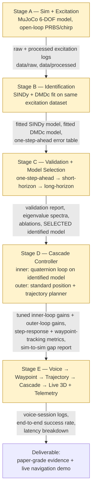
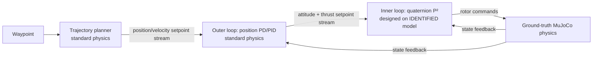

# Design Flow — Stage A → E

## Per-stage artifact contract

| Stage | Produces | Consumed by |
|---|---|---|
| A | `data/raw/*.parquet` (raw state+control logs), response plots | Stage B (preprocessing input) |
| B | `data/processed/*.parquet` (smoothed/differentiated), `data/processed/trial_split.parquet`, fitted SINDy model object, fitted DMDc model object, one-step-ahead error table | Stage C (validation input) |
| C | Short/long-horizon rollout plots, eigenvalue spectra, sparsity/noise ablations, SINDy-vs-DMDc report, written model-selection decision | Stage D (which model's dynamics the inner loop is designed against) |
| D | Tuned inner-loop controller (`04_control/controller.py`), trajectory planner (`04_control/trajectory.py`), outer-loop position controller (`04_control/position_controller.py`), step-response + waypoint-tracking metrics (identified-model-driven vs. ground-truth-driven), sim-to-sim gap report | Stage E (the cascade voice commands drive) |
| E | Live 3D navigation demo, telemetry panel, `data/*` voice-session logs, success-rate + latency report | Final deliverable |

## Inside Stage D: the cascade

Only the inner loop's *design* depends on data-driven identification — the
trajectory planner and outer loop are standard, known physics, chosen
deliberately so all identification rigor stays concentrated on attitude
dynamics (see `TDD.md` §7b and `PRD.md` §1 for the justification).

## Hard flow constraints (see `../CLAUDE.md` for the full rule list)

- Stage A data collection is always open-loop — no controller in the loop,
  so it stays valid as identification input.
- Stage B/C never touch data that hasn't been through Stage A's excitation
  protocol, and never evaluate on anything but genuinely held-out trials.
- Stage D's **inner-loop** design targets the Stage-C-selected identified
  model — ground-truth MuJoCo is used only for the sim-to-sim gap check,
  never as the design plant. The outer loop and trajectory planner are
  standard physics and are never "identified" — see `TDD.md` §7b.
- Stage E's voice pipeline talks only to the Stage D cascade (trajectory
  planner → outer loop → inner loop). It never bypasses the inner loop to
  drive ground-truth MuJoCo directly.
